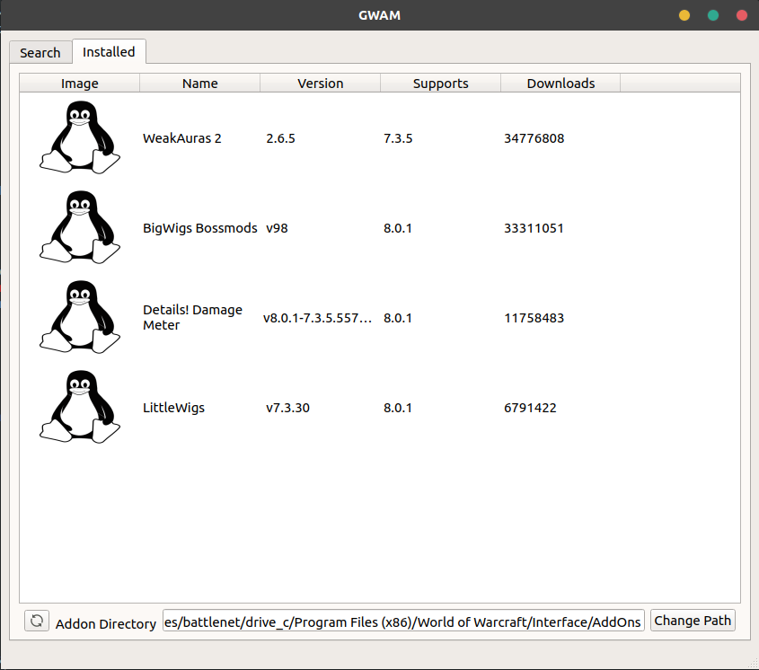

# GWAM (NNF ¯\\\_(ツ)\_/¯)

GWAM is a generic addon manager for world of warcraft. It currently relies
on the availability of the same database file the twitch client uses to
get information about available addons on the twitch website, but in the future
more sources can be added like wowinterface and git repositories.

Since World of Warcraft itself works really well through wine (especially with
[DXVK](https://github.com/doitsujin/dxvk), which is really easy to use due to
[Lutris](https://github.com/lutris/lutris).) the only thing I was missing when
playing on Linux was a addon manager that took care of updating my addons
automatically.

When I started this project the twitch client did not work
through wine. I've had some luck getting it to work afterwards, but even if it
ends up working I'm more interested in a native client. Hence this project!

### TODO before 1.0 release:

- [x] Install addons
	- [x] Get database from curse
	- [x] Parse json into addon objects
	- [x] Download compressed file
	- [x] Unpack compressed file to addon directory
- [ ] Remove addons
	- [ ] Add remove button to UI
	- [ ] Find folders that belong to addon
	- [ ] Delete folders that belong to addon
- [ ] Update addons when available
	- [x] Set addon directory
	- [x] Index already installed addons
	- [ ] Add update button to UI if update available
	- [ ] Use remove function to remove old version
	- [ ] Use download function to download and extract new version

## Build instructions

### Dependencies

- qt5
- libcurl
- libboost
- libminizip
- libzip

### Install prerequisites
To build from source on Ubuntu you need to install the dependencies:
> sudo apt install cmake build-essential libcurl4-openssl-dev qt5-default \\\
libboost-all-dev libminizip-dev libzip-dev nlohmann-json-dev

### Compile
The convetion with cmake is to do a out of tree build:
> mkdir build && cmake .. && make

### Run
> ./gwam

or

> make run

### Install
> sudo make install

### Uninstall
> sudo make unsintall
